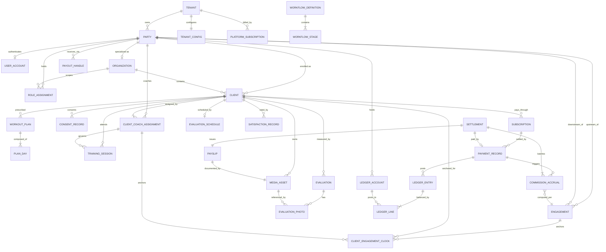

# Data Model & Entity-Relationship Document
## Coaching Business Management Platform ("FitCrew")

**Version:** 1.0
**Date:** 18 July 2026
**Companion documents:** FitCrew PRD v1.0; FitCrew Architecture v2.0
**Purpose:** This document is the single reference for *what data exists and how it relates*. It defines every entity (purpose, attributes, keys), then every relationship (cardinality, direction, and the business rule that justifies it). It is deliberately implementation-neutral: no framework specifics, so it serves the architect, the DBA, and anyone writing migrations equally.

---

## 1. Reading conventions

- **Cardinality notation:** `1` (exactly one), `0..1` (zero or one), `1..*` (one or more), `0..*` (zero or more).
- **Keys:** PK = primary key, FK = foreign key, UK = unique key (may be composite).
- **Tenancy:** every entity marked *(tenant-scoped)* carries a non-null `tenant_id` (FK → Tenant) and is subject to row-level isolation. Entities marked *(platform)* live outside tenant scope.
- **Audit columns:** every entity carries `created_at`, `created_by`, `updated_at`, `updated_by` unless noted as append-only (which carries only `created_at`, `created_by`).
- **Soft rules vs. hard rules:** hard rules are enforced by DB constraints (stated explicitly); soft rules are enforced in the domain layer and noted as such.

## 2. Entity catalog

Entities are grouped by domain area. Each has a purpose, its notable attributes, and its keys/constraints.

### 2.1 Platform & tenancy

**Tenant** *(platform)* — a subscribing coaching business; the isolation boundary for all tenant-scoped data.
- Attributes: `id` (PK), `name`, `status` (active | suspended | trial), `plan_id` (FK → PlatformPlan), `created_at`.
- Notes: the root of every tenant-scoped foreign-key chain. Deleting a tenant is a platform-operator action only and cascades logically (never a casual delete).

**PlatformPlan** *(platform)* — the SaaS subscription tier a tenant is on (pricing/limits for the platform itself, distinct from any client subscription).
- Attributes: `id` (PK), `name`, `price`, `billing_period`, `limits` (JSON).

**PlatformSubscription** *(platform)* — a tenant's active billing relationship with the platform operator.
- Attributes: `id` (PK), `tenant_id` (FK → Tenant, UK — one active per tenant), `plan_id` (FK → PlatformPlan), `status`, `current_period_start/end`.
- **Vocabulary guard:** this is *not* the client's Subscription (§2.4). They never share tables, screens, or terminology.

**TenantConfig** *(tenant-scoped)* — per-tenant configurable business rules (P4: everything that varies is data).
- Attributes: `tenant_id` (PK/FK, one row per tenant), `default_commission_rate`, `default_commission_lifespan_months`, `default_evaluation_cadence`, `fee_bearer` (tenant | client), `satisfaction_mode` (per_session | periodic), `currency` (INR).

### 2.2 Identity, party & access

**Party** *(tenant-scoped)* — a person or institution known to the tenant; the universal actor. One row per real-world entity, regardless of how many roles it plays.
- Attributes: `id` (PK), `tenant_id` (FK), `kind` (person | institution), `display_name`, `contact` (phone/email JSON), `status`.
- **Design keystone:** roles are never baked into this row (§2 rationale in Architecture §6). A coach, an owner, a client, and an org are all Parties differentiated by their RoleAssignments and by the entities that reference them.

**UserAccount** *(tenant-scoped)* — login credentials for a Party that can authenticate. Not every Party has one (clients have none in MVP).
- Attributes: `id` (PK), `tenant_id` (FK), `party_id` (FK → Party, UK — at most one account per party), `email` (UK within tenant), `password_hash`, `status`, `last_login_at`.

**RoleAssignment** *(tenant-scoped)* — grants a Party a role within a scope. The mechanism for multi-role identity.
- Attributes: `id` (PK), `tenant_id` (FK), `party_id` (FK → Party), `role` (OwnerAdmin | Coach | OrgAdmin | Client), `scope_type` (tenant | organization), `scope_id` (nullable FK — Organization id when scope_type = organization), `valid_from`, `valid_to` (nullable = open-ended).
- Constraints: soft rule — a role's scope_type must match its allowed scopes (OwnerAdmin ⇒ tenant; OrgAdmin ⇒ organization; Coach ⇒ tenant or organization). Tuple-shaped by design so AccessGate rules can evaluate scoped role assignments consistently.

**Invite** *(tenant-scoped)* — a single-use, expiring token to onboard a Coach or an Organization admin without the owner doing data entry.
- Attributes: `id` (PK), `tenant_id` (FK), `token_hash` (UK), `role`, `scope_type`, `scope_id`, `email`, `expires_at`, `consumed_at` (nullable), `created_by`.

**AuditLog** *(tenant-scoped, append-only)* — immutable record of every access-sensitive and money action.
- Attributes: `id` (PK), `tenant_id` (FK), `actor_party_id` (FK → Party), `action`, `resource_type`, `resource_id`, `before` (JSON, nullable), `after` (JSON, nullable), `created_at`.

### 2.3 Network & commercial relationships

**Organization** *(tenant-scoped)* — a partner institution (e.g., a hospital) that self-manages a set of member clients. Modeled as a specialized Party plus an agreement.
- Attributes: `id` (PK), `tenant_id` (FK), `party_id` (FK → Party where kind = institution, UK), `agreement_terms` (JSON: one-time payment amount, dates), `status`.
- Notes: its members are ordinary Clients (§2.4) whose `organization_id` points here — the "bulk client" model. No separate member entity exists.

**Engagement** *(tenant-scoped)* — the commercial edge between two Parties: the relationship under which an upstream party earns a commission on a downstream party's client revenue. Carries all commercial terms.
- Attributes: `id` (PK), `tenant_id` (FK), `upstream_party_id` (FK → Party), `downstream_party_id` (FK → Party), `commission_rate` (numeric, 0–100), `commission_lifespan_months` (int), `valid_from`, `valid_to` (nullable), `terms` (JSON).
- Constraints: **hard** — `CHECK (upstream_party_id <> downstream_party_id)` (self-loop guard); **hard** — partial unique index preventing overlapping active edges for the same pair; soft — rate within 0–100, lifespan in the tenant's allowed set.
- Notes: MVP uses one hop (owner → coach). The entity is general so new relationship types are new rows, not new tables.

**PayoutHandle** *(tenant-scoped)* — a Party's payment-receipt coordinates, displayed at pay time.
- Attributes: `id` (PK), `tenant_id` (FK), `party_id` (FK → Party), `type` (upi | phone | qr), `value` (UPI id / phone), `qr_asset_id` (nullable FK → MediaAsset), `is_default`.

### 2.4 Client lifecycle

**Client** *(tenant-scoped)* — the enrollment context for a Party being trained. (The person is a Party; the Client row is their enrollment.)
- Attributes: `id` (PK), `tenant_id` (FK), `party_id` (FK → Party where kind = person, UK per active enrollment), `current_coach_assignment_id` (nullable FK → ClientCoachAssignment), `organization_id` (nullable FK → Organization — null = direct client, set = org member), `enrolled_by_party_id` (FK → Party), `custom_price` (numeric), `schedule` (JSON: timings), `photo_consent` (bool, denormalized current state), `photo_consent_at` (nullable), `status` (active | paused | left), `workflow_state` (current stage ref).
- Notes: an individual client and an org member differ only by `organization_id`. Current coach is a pointer to assignment history, not the source of truth.

**ClientCoachAssignment** *(tenant-scoped, append-only except closing `valid_to`)* — history of who was responsible for a Client during a date range.
- Attributes: `id` (PK), `tenant_id` (FK), `client_id` (FK → Client), `coach_party_id` (FK → Party), `assigned_by_party_id` (FK → Party), `valid_from`, `valid_to` (nullable = current), `reason` (nullable).
- Constraints: hard — no overlapping assignment ranges for the same Client; soft — coach_party_id must hold a live Coach role in the relevant tenant/org scope at `valid_from`.
- Notes: sessions, evaluations, access checks, and commission clocks resolve against this history for the event date.

**ConsentRecord** *(tenant-scoped, append-only)* — auditable consent grant/withdrawal for sensitive client media.
- Attributes: `id` (PK), `tenant_id` (FK), `client_id` (FK → Client), `purpose` (progress_photo | health_measurement | other), `policy_version`, `state` (granted | withdrawn), `captured_by_party_id` (FK → Party), `capture_source` (owner | coach | org_admin | client_phase2), `captured_at`, `withdrawn_at` (nullable), `notes` (nullable).
- Notes: `Client.photo_consent` is derived/current convenience; this table is the legal/audit source.

**WorkflowDefinition** *(tenant-scoped)* — ordered lifecycle definition for a tenant.
- Attributes: `id` (PK), `tenant_id` (FK), `name`, `version`, `status` (draft | active | retired), `created_at`, `activated_at` (nullable).
- Constraints: hard — at most one active definition per tenant.

**WorkflowStage** *(tenant-scoped)* — one configured stage inside a WorkflowDefinition.
- Attributes: `id` (PK), `tenant_id` (FK), `workflow_definition_id` (FK → WorkflowDefinition), `sequence`, `step_type`, `config` (JSON), `is_required`.
- Constraints: UK `(tenant_id, workflow_definition_id, sequence)`; soft — `step_type` must match a registered LifecycleStep in application code.

**Subscription** *(tenant-scoped, append-on-renewal)* — a paid term of training for a Client. Renewals append new rows; the record is a history, not a mutable field.
- Attributes: `id` (PK), `tenant_id` (FK), `client_id` (FK → Client), `price` (numeric), `start_date`, `duration_months`, `end_date` (derived), `status` (active | lapsed | renewed | cancelled), `previous_subscription_id` (nullable FK → self, for renewal chains).
- Constraints: soft — price becomes immutable once its first PaymentRecord is confirmed.

**WorkoutPlan** *(tenant-scoped, versioned)* — a prescribed day-wise program for a Client. Editing creates a new version.
- Attributes: `id` (PK), `tenant_id` (FK), `client_id` (FK → Client), `version` (int), `is_current` (bool), `created_by_party_id` (FK → Party, the coach).

**PlanDay** *(tenant-scoped)* — one day within a WorkoutPlan.
- Attributes: `id` (PK), `tenant_id` (FK), `plan_id` (FK → WorkoutPlan), `day_number`, `exercises` (JSON list referencing ExerciseCatalog), `notes`.

**TrainingSession** *(tenant-scoped, append-only)* — a record of an *actual* training session that occurred (distinct from the prescribed plan). The WhatsApp-replacement log.
- Attributes: `id` (PK), `tenant_id` (FK), `client_id` (FK → Client), `coach_assignment_id` (FK → ClientCoachAssignment), `coach_party_id` (FK → Party snapshot), `session_date`, `start_time`, `end_time`, `exercises_performed` (JSON), `notes`.
- Notes: highest-write entity; indexed `(tenant_id, coach_party_id, session_date desc)`.

**ExerciseCatalog** *(tenant-scoped, with optional global seed)* — the library of exercises referenced by plans and sessions.
- Attributes: `id` (PK), `tenant_id` (FK, nullable for global-seed rows), `name`, `muscle_group`, `metadata` (JSON).

**Evaluation** *(tenant-scoped, append-only)* — a periodic body-composition/posture assessment capturing a point-in-time snapshot and its computed change since baseline/prior.
- Attributes: `id` (PK), `tenant_id` (FK), `client_id` (FK → Client), `coach_assignment_id` (nullable FK → ClientCoachAssignment), `evaluated_by_party_id` (FK → Party), `evaluated_at`, `type` (baseline | periodic), `measurements` (JSON: weight, body_fat_pct, muscle_mass, bmi, extensible), `posture_notes`, `deltas` (JSON, computed and frozen at write), `cadence_context`.
- Notes: `deltas` are denormalized deliberately — a historical fact must not change if a baseline is later corrected; corrections create new rows.

**EvaluationSchedule** *(tenant-scoped)* — the cadence on which a Client is evaluated; drives due-date computation and reminders.
- Attributes: `id` (PK), `tenant_id` (FK), `client_id` (FK → Client, UK — one active schedule), `cadence` (weekly | biweekly | monthly), `next_due_date`, `is_active`.

**SatisfactionRecord** *(tenant-scoped, append-only)* — a client-satisfaction signal feeding the owner's dashboard.
- Attributes: `id` (PK), `tenant_id` (FK), `client_id` (FK → Client), `source` (per_session | periodic), `session_id` (nullable FK → TrainingSession), `rating`, `comment`, `recorded_at`.

**MediaAsset** *(tenant-scoped)* — metadata for a stored file (progress photo, QR image). The blob itself lives in object storage; this row is the access-controlled handle.
- Attributes: `id` (PK), `tenant_id` (FK), `owner_client_id` (nullable FK → Client, for progress photos), `blob_path`, `content_type`, `kind` (progress_photo | qr | other), `status` (active | tombstoned), `created_at`.
- Notes: reads are always brokered through the access gate → short-lived signed URL; no durable public link exists.

**EvaluationPhoto** *(tenant-scoped, append-only)* — explicit link between an Evaluation and its progress-photo assets.
- Attributes: `id` (PK), `tenant_id` (FK), `evaluation_id` (FK → Evaluation), `media_asset_id` (FK → MediaAsset), `view_type` (front | side | back | other), `status` (active | removed), `removed_at` (nullable), `removal_reason` (nullable).
- Constraints: UK `(tenant_id, evaluation_id, view_type)` for active rows unless multiple-per-view is explicitly enabled later.
- Notes: side-by-side comparison reads this table; deleted photos leave removed markers without retaining the blob.

### 2.5 Money

**LedgerAccount** *(tenant-scoped)* — a bucket in the double-entry ledger, per party per purpose.
- Attributes: `id` (PK), `tenant_id` (FK), `party_id` (FK → Party), `purpose` (client_receivable | owner_cash | coach_payable | commission_income | org_agreement_receivable), `currency`.
- Constraints: UK `(tenant_id, party_id, purpose)`.

**LedgerEntry** *(tenant-scoped, append-only)* — one immutable journal transaction; the atomic unit of financial truth.
- Attributes: `id` (PK), `tenant_id` (FK), `description`, `reference_type` (payment | settlement | correction), `reference_id`, `created_at`.
- **Hard rule:** the sum of its LedgerLines is zero — enforced by a deferred DB trigger. No update, no delete; reversals are new entries.

**LedgerLine** *(tenant-scoped, append-only)* — one debit or credit within a LedgerEntry.
- Attributes: `id` (PK), `tenant_id` (FK), `entry_id` (FK → LedgerEntry), `account_id` (FK → LedgerAccount), `direction` (debit | credit), `amount` (numeric > 0).
- Constraints: each entry has `2..*` lines; sum(debits) = sum(credits).

**PaymentRecord** *(tenant-scoped)* — the confirmation artifact for money moving in (client → owner) or out (owner → coach). Posts to the ledger only once confirmed.
- Attributes: `id` (PK), `tenant_id` (FK), `payer_party_id` (FK → Party), `payee_party_id` (FK → Party), `subscription_id` (nullable FK → Subscription), `settlement_id` (nullable FK → Settlement), `organization_id` (nullable FK → Organization for agreement payments), `purpose` (client_subscription | coach_payout | org_agreement | correction), `amount`, `method` (upi | qr | phone | other), `status` (pending | confirmed | reversed), `proof_ref` (UTR / MediaAsset id), `confirmation_source` (manual | gateway), `confirmed_by_party_id` (nullable FK → Party), `confirmed_at` (nullable).
- Notes: `confirmation_source` is the entire phase-2 payment migration surface.

**CommissionAccrual** *(tenant-scoped, append-only)* — the owner's retained cut for one confirmed client payment against one Engagement; separated from ledger lines so payslips can show their work.
- Attributes: `id` (PK), `tenant_id` (FK), `payment_id` (FK → PaymentRecord), `engagement_id` (FK → Engagement), `client_id` (FK → Client), `coach_assignment_id` (FK → ClientCoachAssignment), `gross_amount` (snapshot), `rate_applied` (snapshot), `commission_amount` (owner retained cut), `coach_payable_amount` (gross minus commission), `within_lifespan` (bool snapshot), `settlement_id` (nullable FK → Settlement — null = unsettled).

**ClientEngagementClock** *(tenant-scoped)* — the commission-lifespan anchor per (Client, Engagement); the small state that makes flexible lifespans implementable.
- Attributes: `id` (PK), `tenant_id` (FK), `client_id` (FK → Client), `engagement_id` (FK → Engagement), `coach_assignment_id` (FK → ClientCoachAssignment), `anchor_date` (first confirmed payment date).
- Constraints: UK `(tenant_id, client_id, engagement_id, coach_assignment_id)`.

**Settlement** *(tenant-scoped)* — a batch of a coach's accrued payables for a period, paid out together.
- Attributes: `id` (PK), `tenant_id` (FK), `coach_party_id` (FK → Party), `period_start`, `period_end`, `total_amount`, `status` (draft | paid), `payout_payment_id` (nullable FK → PaymentRecord).

**Payslip** *(tenant-scoped, append-only)* — the immutable transparency document generated when a Settlement is paid.
- Attributes: `id` (PK), `tenant_id` (FK), `settlement_id` (FK → Settlement, UK), `gross_revenue`, `commission_deducted`, `net_paid`, `detail` (JSON: per-accrual breakdown), `document_ref` (FK → MediaAsset, the PDF), `issued_at`.

## 3. Relationship reference

Each relationship below is stated as **A — verb — B**, with cardinality and the rule that justifies it.

### 3.1 Tenancy & platform
- **Tenant `1` — has — `0..*` PlatformSubscription**, but exactly `0..1` *active* (UK on active). A tenant is billed under one active plan at a time.
- **PlatformPlan `1` — priced for — `0..*` PlatformSubscription.**
- **Tenant `1` — configured by — `1` TenantConfig.** One config row per tenant; all business-variable rules live here.
- **Tenant `1` — owns — `0..*` [every tenant-scoped entity].** The universal isolation relationship; enforced by RLS.

### 3.2 Party, identity & access
- **Party `1` — may authenticate via — `0..1` UserAccount.** Clients have none in MVP; attaching one later is the phase-2 client-login change.
- **Party `1` — holds — `0..*` RoleAssignment.** The multi-role mechanism: one Party can be OwnerAdmin *and* Coach@Organization simultaneously.
- **RoleAssignment `0..*` — scoped to — `0..1` Organization** (when scope_type = organization). A coach or org-admin assignment names the org it applies within.
- **Party `1` — is target/actor of — `0..*` AuditLog.** Every sensitive action names its actor Party.
- **Invite `0..*` — grants (on consumption) — `1` RoleAssignment.** Consuming an invite creates the assignment and stamps `consumed_at`.

### 3.3 Network & commerce
- **Party `1` — specialized as — `0..1` Organization** (only Parties of kind = institution). The org is a Party plus an agreement.
- **Party `1` — is upstream of — `0..*` Engagement** and **Party `1` — is downstream of — `0..*` Engagement.** Two distinct FKs from Engagement into Party; the same person is upstream on some edges and downstream on others (the owner-as-also-a-coach case).
- **Engagement** relates exactly **`1` upstream Party** to **`1` downstream Party**, with `upstream <> downstream` (hard constraint). One hop in MVP; general by design.
- **Party `1` — receives via — `0..*` PayoutHandle.** A party can register several handles; one default.

### 3.4 Client lifecycle
- **Party `1` — enrolled as — `0..*` Client** (typically `0..1` active). The Client row is the enrollment of a person-Party.
- **Client `1` — has — `1..*` ClientCoachAssignment.** Every active client has exactly one current assignment (`valid_to` null); reassignments close the old row and append a new row.
- **ClientCoachAssignment `0..*` — assigns — `1` Coach (Party).** Sessions, evaluations, access checks, and commission clocks use the assignment active at the event date.
- **Client `1` — has — `0..*` ConsentRecord.** Consent grants and withdrawals are append-only; `Client.photo_consent` is only the current-state cache.
- **Tenant `1` — defines — `0..*` WorkflowDefinition**, with exactly `0..1` active; **WorkflowDefinition `1` — contains — `1..*` WorkflowStage.**
- **Organization `1` — contains — `0..*` Client** (its members). `Client.organization_id` null ⇒ direct client; set ⇒ org member. Same entity either way.
- **Client `1` — pays through — `1..*` Subscription** (a history; `0..*` if a just-enrolled client is not yet subscribed). Renewals chain via `previous_subscription_id`.
- **Client `1` — prescribed — `0..*` WorkoutPlan**, of which exactly `0..1` is current (`is_current`). Editing creates a new version.
- **WorkoutPlan `1` — composed of — `1..*` PlanDay.**
- **Client `1` — attends — `0..*` TrainingSession**, each logged by its **`1` coach Party.** The actual-events log.
- **TrainingSession/PlanDay `0..*` — reference — `0..* ExerciseCatalog`** entries (via JSON list, not a hard FK, to keep the hot write path join-free).
- **Client `1` — measured by — `0..*` Evaluation** (one of type = baseline, then periodic). Deltas frozen at write.
- **Client `1` — scheduled by — `0..1` EvaluationSchedule.** One active cadence; drives reminders.
- **Client `1` — rated by — `0..*` SatisfactionRecord**, optionally tied to `0..1` TrainingSession (per-session mode).
- **Client `1` — owns — `0..*` MediaAsset** (progress photos). Consent must have a live granted ConsentRecord before any capture — soft rule enforced in the domain and the capture UI.
- **Evaluation `1` — links — `0..*` EvaluationPhoto**, each pointing to `1` MediaAsset. Photo comparison never infers evaluation membership from loose client-level assets.

### 3.5 Money
- **Party `1` — holds — `0..*` LedgerAccount** (one per purpose). Accounts created lazily.
- **LedgerEntry `1` — balanced by — `2..*` LedgerLine**, sum-to-zero (hard trigger). The atomic financial fact.
- **LedgerLine `0..*` — posts to — `1` LedgerAccount.**
- **Subscription `1` — settled by — `0..*` PaymentRecord** (each due payment). A PaymentRecord for a payout instead references `0..1` Settlement; a PaymentRecord for an org agreement references `0..1` Organization.
- **PaymentRecord `1` — (on confirmation) posts — `1..*` LedgerEntry** and **triggers `0..*` CommissionAccrual.** A confirmed client payment books the receivable/cash entry and accrues commission; a payout books the payable/cash-out entry.
- **CommissionAccrual `0..*` — computed per — `1` Engagement**, for `1` Client and `1` ClientCoachAssignment, from `1` PaymentRecord, with gross, owner commission, coach payable, `rate_applied`, and `within_lifespan` snapshotted.
- **Client + Engagement + ClientCoachAssignment `1` — anchored by — `1` ClientEngagementClock.** The lifespan window's start; created on first confirmed payment.
- **Settlement `1` — batches — `1..*` CommissionAccrual** (each accrual settles exactly once — `settlement_id` set when included).
- **Settlement `1` — paid by — `0..1` PaymentRecord** (the payout) and **issues — `1` Payslip.**
- **Payslip `1` — documented by — `1` MediaAsset** (the immutable PDF).

## 4. Entity-relationship diagram (core)

## 5. Design rationale summary (why the model looks like this)

- **Party is universal; roles and enrollments hang off it.** This is the single decision that lets one person be owner + coach, and lets an organization be a "bulk client" without a parallel entity tree. Every alternative (separate Coach/Client/Owner tables) breaks on the multi-role and org-member cases already present in requirements.
- **Engagement carries commerce, not the person — and it references Party twice.** `Engagement.upstream_party_id` and `Engagement.downstream_party_id` are two independent foreign keys into the same `Party` table. This is precisely what makes the owner-who-is-also-a-coach case fall out for free: the same Party row sits on the *upstream* side of the edges where he earns a cut (as OwnerAdmin over his direct coaches) and on the *downstream* side of an edge where he himself is earning as a Coach under a partner organization. No special "dual-role edge" type is needed — it is the same table, read from two directions.
- **Client identity and coach responsibility are deliberately separate.** `Client.party_id` is the person being trained; `ClientCoachAssignment.coach_party_id` is the coach responsible during a dated window. This keeps the flexible Party model while making reassignment auditable: sessions, evaluations, access checks, and commission clocks can all answer "who was responsible on this date?" without rewriting history.
- **The ledger is append-only and derived.** Balances, payables, and payslips are computations over immutable entries — the only structure that makes money disputes resolvable and refunds clean.
- **The commission clock is its own tiny entity.** Per-client lifespan windows are impossible without an anchor per (client, engagement); isolating it keeps the engine a one-line comparison.
- **Historical facts are frozen at write** (evaluation deltas, accrual rate/window, payslip numbers). Later corrections append; they never rewrite the past.
- **Media is metadata-plus-brokered-blob.** The sensitive-photo requirement forces access to route through the gate every time, so no durable link can leak.

## 6. Open modeling questions (to confirm)
1. **One person, two concurrent enrollments** (direct + via an org): the model allows it (multiple Client rows per Party); confirm the business wants it and how billing separates.
2. **Org's own coaches:** if an Organization ever brings coaches whose payroll runs through the tenant, an Engagement with the org as upstream covers it — confirm this matches intent before relying on it.
3. **Exercise catalog scope:** global seed + per-tenant additions (nullable tenant_id) vs. strictly per-tenant — affects the ExerciseCatalog key.
